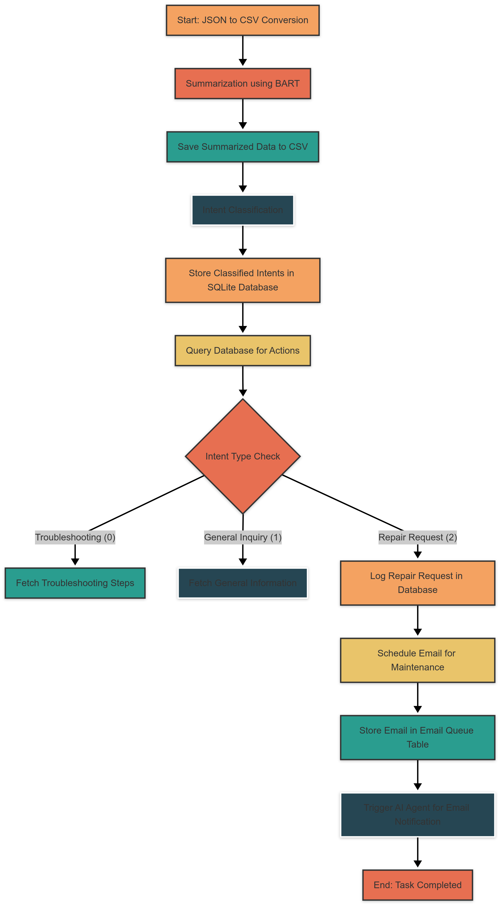

# Ticket-system
# **AI-Powered Home Appliance Query System**

## **Overview**
This project automates the **processing, classification, and resolution of home appliance issues** using AI. The system:
- **Summarizes user queries** and AI responses using **Facebook BART**.
- **Classifies intents** (**troubleshooting, general inquiry, repair request**).
- **Stores classified intents** in an **SQLite database**.
- **Queries the database** to **fetch or log requests**.
- **Schedules an email** for maintenance requests.
- **Pipelines the entire workflow** into a seamless process.

---

## **Workflow Pipeline**
The project follows an **end-to-end pipeline**, with the following steps:

1. **Convert JSON to CSV** – Extract structured data from raw inputs.
2. **Summarize Queries** – Use Facebook BART to generate concise summaries.
3. **Classify Intents** – Assign intent types (`troubleshooting, inquiry, repair`).
4. **Store Data in SQLite Database** – Organize troubleshooting info, inquiries, and repair requests.
5. **Query Database** – Determine the next action based on intent.
6. **Schedule Maintenance Emails** – Add repair requests to an email queue.
7. **Trigger AI Agent for Notifications** – Process scheduled emails for task completion.

---

## **Project Structure**
```
📁 data/                             # Data directory
   ├── home_appliance_query_response.csv  # Raw queries & responses
   ├── home_appliance_summary.csv         # Summarized data
   ├── home_appliance_summary_labeled.csv # Intent-classified data

📁 database/                         # SQLite database
   ├── home_appliance.db              # Stores troubleshooting, inquiries, repairs

📁 scripts/                           # All processing scripts
   ├── summarize_home_appliance.py    # Summarization using BART
   ├── qdslite.py                     # Intent classification & database storage
   ├── query_database.py              # Database interaction (fetch/log requests)
   ├── SE.py                          # Schedules maintenance request emails
   ├── test.py                        # AI Agent processing scheduled emails
   ├── run_pipeline.py                # End-to-end workflow execution

📄 README.md                          # Documentation
```

---

## **Setup & Installation**
### **1. Install Dependencies**
Ensure you have Python 3.8+ and install required packages:
```bash
pip install pandas transformers sqlite3
```

### **2. Set Up the Database**
Initialize the SQLite database and required tables:
```bash
python query_database.py
```

### **3. Run the Complete Pipeline**
Execute the entire AI pipeline in one command:
```bash
python run_pipeline.py
```

---

## **Workflow Details**
### **Step 1: Summarization**
- **Converts JSON to CSV**.
- **Summarizes user-AI interactions** using **Facebook BART**.
- **Saves the output** to `home_appliance_summary.csv`.

### **Step 2: Intent Classification & Database Storage**
- **Classifies intent types** (`troubleshooting, inquiry, repair`).
- **Stores classified data** in **SQLite database**.

### **Step 3: Query Database for Next Steps**
- **Checks for troubleshooting & inquiries**.
- **Logs repair requests**.

### **Step 4: Email Scheduling**
- **Adds pending repair requests** to an **email queue**.

### **Step 5: AI Agent Processes Emails**
- **Retrieves scheduled emails**.
- **Sends or logs emails** for maintenance confirmation.

---

## **Viewing Stored Data**
### **Check All Troubleshooting Records**
```sql
SELECT * FROM troubleshooting;
```

### **Check All Repair Requests**
```sql
SELECT * FROM repair_requests;
```

### **Check Scheduled Emails**
```sql
SELECT * FROM email_queue;
```

---

## **Features & Future Enhancements**
✅ **End-to-end AI pipeline** for **query processing & classification**  
✅ **Automated database interactions** via **Text-to-SQL**  
✅ **Email scheduling for repair requests**  
✅ **Completely modular & scalable** 

## **Workflow Pipeline**
Below is the **workflow diagram** for the project




